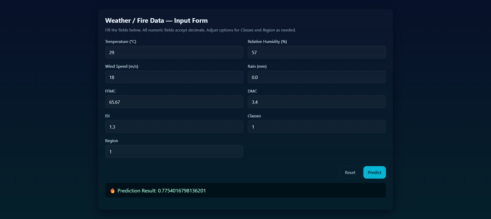

# 🌲 Algerian Forest Fire Prediction using Ridge Regression

This project predicts the **Fire Weather Index (FWI)** for the **Algerian Forest Fire Dataset** using machine learning.  
It includes a **Flask web application** that allows users to input weather parameters (Temperature, RH, Wind Speed, Rain, etc.) and get a **predicted FWI** instantly.

---

## 📘 Project Overview

Forest fires are among the most devastating natural disasters, and early prediction can help prevent massive environmental losses.  
This project focuses on predicting **Fire Weather Index (FWI)** using meteorological parameters from the Algerian Forest Fire dataset.

After testing multiple regression algorithms, **Ridge Regression** was chosen because it provided the **best performance and least overfitting** compared to other models.

---

## 🚀 Features

- End-to-end **Machine Learning pipeline**
- **Data cleaning and EDA** using Jupyter notebooks
- Model training with **Ridge Regression**
- Scaled data using **StandardScaler**
- Flask-based **web app** for user input and prediction
- **Interactive form** for entering temperature, humidity, wind speed, rainfall, etc.
- Instant FWI prediction on the same page (no reload)

---

## 🧠 Tech Stack

| Category | Tools / Libraries |
|-----------|-------------------|
| Programming | Python |
| Data Handling | Pandas, NumPy |
| Model | Ridge Regression (scikit-learn) |
| Visualization | Matplotlib, Seaborn |
| Web Framework | Flask |
| Frontend | HTML, CSS, JavaScript |
| Deployment | Localhost / GitHub integration ready |

---

## 📊 Dataset

**Algerian Forest Fire Dataset**  
Contains meteorological variables:
- Temperature (°C)
- Relative Humidity (%)
- Wind Speed (Km/h)
- Rain (mm)
- FFMC, DMC, DC, ISI, BUI
- Region (Bejaia, Sidi Bel-abbes)
- Class (Fire / Not Fire)

Dataset Source: [UCI Machine Learning Repository](https://archive.ics.uci.edu/ml/datasets/Algerian+Forest+Fires+Dataset+)

---

## 📈 Model Performance
| Category | MAE | R2 Score|
|----------|------|--------|
|Linear Regression | 0.54 |0.98|
|Lasso Regression | 1.13 | 0.94 |
|Ridge Regression | 0.56 | 0.984 |

✅ Ridge Regression was selected because it generalized best on unseen data.

## Project Screenshot

## 🧑‍💻 Author

Harsh Patil
📧 [harshrp2309@gmail.com]

